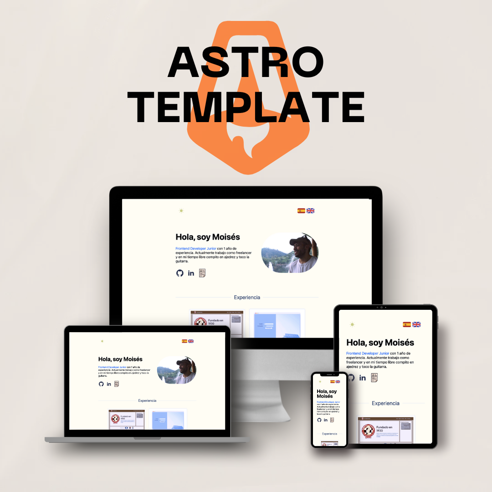

# Astro Starter Kit: Basics

```sh
npm create astro@latest -- --template basics
```

> 🧑‍🚀 **Seasoned astronaut?** Delete this file. Have fun!

🖼️  **Project**




## 🚀 Project Structure

Inside of this template, you'll see the following folders and files:

```text
/
├── public/
│   └── flags
│   │   └── flag-of-spain.png
│   │   └── flag-of-uk.png
│   └── icon
│   │   └── mountain.png
│   └── CertificadoJava.pdf
│   └── FrontendJunior-cv.pdf
│   └── FrontendJuniorEn-cv.pdf
├── src/
│   ├── assets/img
│   │   └── Card.astro
│   ├── components/
│   │   └── footer/
│   │   └── pages/
│   │   └── theme/
│   ├── LanguagePicker.astro
│   ├── NavBar.astro
│   ├── form.jsx
│   ├── i18n/
│   │   └── english.json
│   │   └── index.ts
│   │   └── spanish.json
│   │   └── ui.ts
│   │   └── utils.ts
│   ├── layouts/
│   │   └── Layout.astro
│   └── pages/
│       └── en/
            └── index.astro
│       └── index.astro
└── package.json
```

This template has been created using Tailwind, React and Typescript. No additional libraries are needed for the i18n (Internationalization of the template "language Picker")


Any static assets, like images, can be placed in the `public/` directory. You can do it also in `src/assets/img`,so when loading the page, being in the src folder, it loads at the same time as the page.


## 👀 Want to learn more?

Feel free to send me an email to moiamdev@gmail.com 
